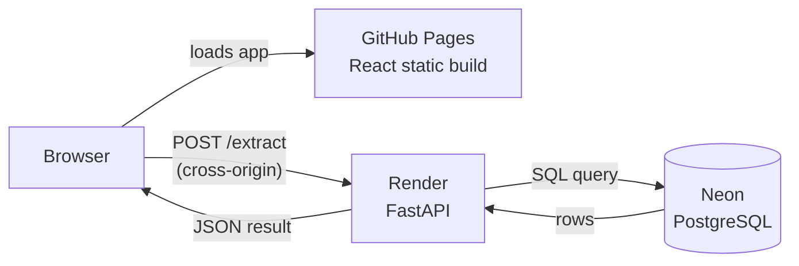
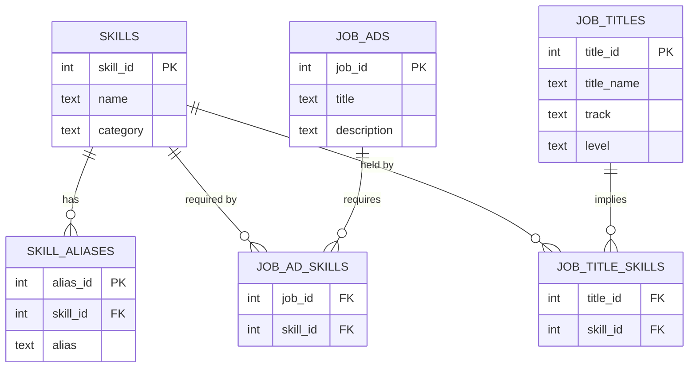

# Skill Matcher


Paste a job description, pick a job title, and see how your skills match.

**Live demo:** https://plokm1234.github.io/skill-matcher/

## Known limitations

> [!WARNING]
> **Demo hosting runs on free-tier infrastructure (Render + Neon); the first request after a period of inactivity may take up to a minute to respond.**

- The noise-stripping heuristic (`extract_description_block`) is marker-based, not a full HTML parser — it can miss the description block on job boards that don't use a "job description" style header.
- Matching is exact-phrase, not semantic — a job ad has to use the same wording as the skill dictionary (or a listed alias) to be detected.

## Architecture



Frontend and API sit on different origins by design — the browser calls
Render directly, and the response never routes back through GitHub Pages.
That boundary is why CORS is configured explicitly in `backend/app/main.py`.

## Database schema



`skills` is the hub between job postings and job titles — each many-to-many
relationship is mediated by its own junction table, not a shared column.

## What this demonstrates

- **Matching engine** — word-boundary regex matching from a skill
  dictionary outward into free text, so multi-word skills ("machine
  learning") match as whole phrases without tokenization.
- **Noise handling** — a marker-based heuristic that trims job-board page
  chrome from a raw copy-paste, validated against real CTgoodjobs and
  Indeed postings (see `backend/tests/test_matching.py`).
- **Relational schema** — PostgreSQL (Neon) with junction tables for the
  two many-to-many relationships above.
- **Rule-based suggestions** — a deterministic decision tree (no AI) that
  distinguishes a same-track skill gap from a cross-track career change.
- **REST API** — FastAPI with auto-generated docs at `/docs`.

## Project structure

```
backend/
  app/
    matching.py      # skill dictionary → text matching + noise stripping
    suggestion.py     # match %, gap, and the rule-based suggestion
    database.py       # Postgres queries
    main.py            # FastAPI app, /extract and /titles endpoints
  db/
    schema.sql         # table definitions
    seed.sql            # starter skills + the 5 front-end job titles
  tests/
frontend/
  src/
    JobMatcher.jsx     # the whole UI: title row, manual/demo toggle, results
```

## Running locally

**Backend**

```bash
cd backend
python3 -m venv venv && source venv/bin/activate
pip install -r requirements.txt

# Point at a Neon Postgres instance, then load the schema:
export DATABASE_URL="postgresql://..."
python3 -c "
import psycopg2, os
conn = psycopg2.connect(os.environ['DATABASE_URL']); conn.autocommit = True
cur = conn.cursor()
for f in ['db/schema.sql', 'db/seed.sql']:
    cur.execute(open(f).read())
"

uvicorn app.main:app --reload
```

**Frontend**

```bash
cd frontend
npm install
npm run dev
```

**Tests**

```bash
cd backend
python -m pytest tests/ -v
```
